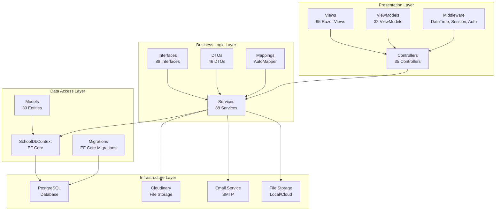
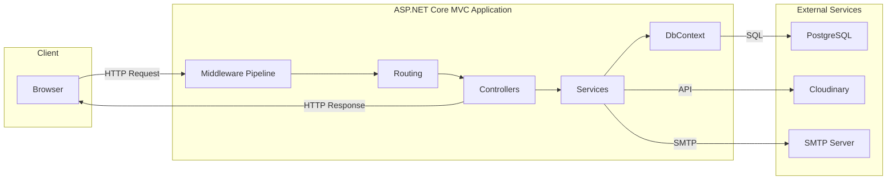
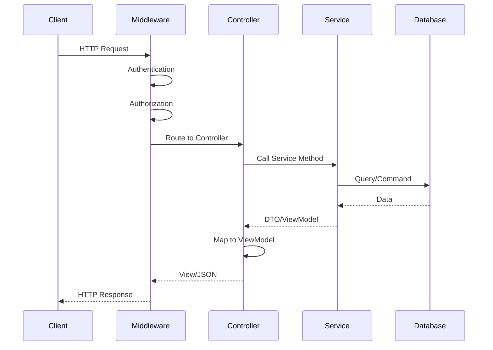
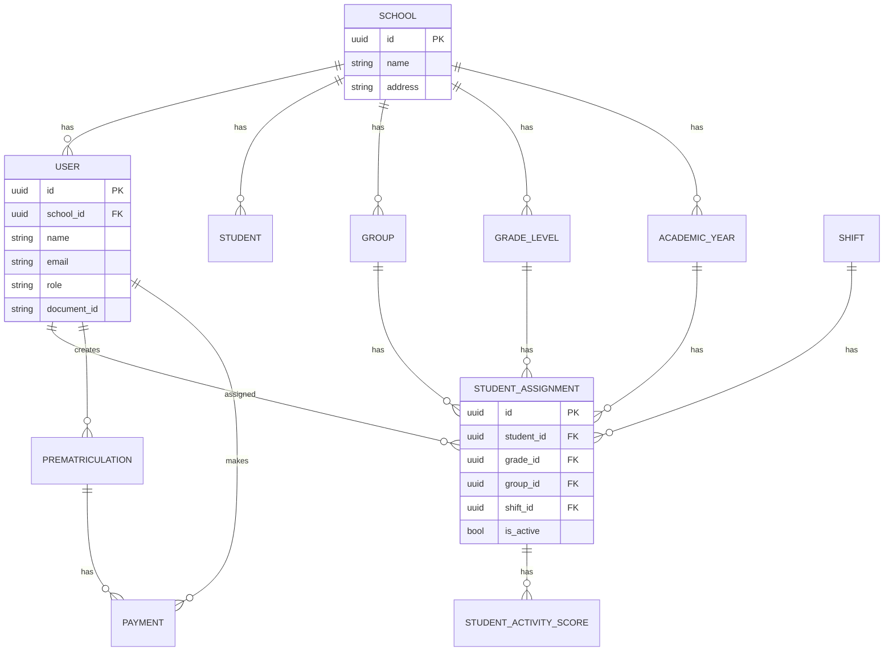
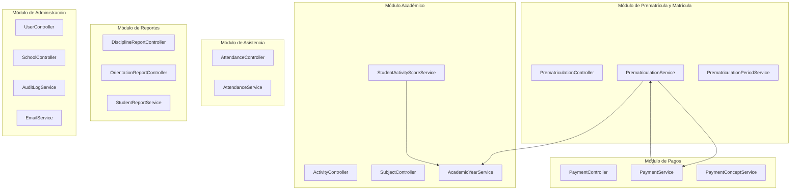
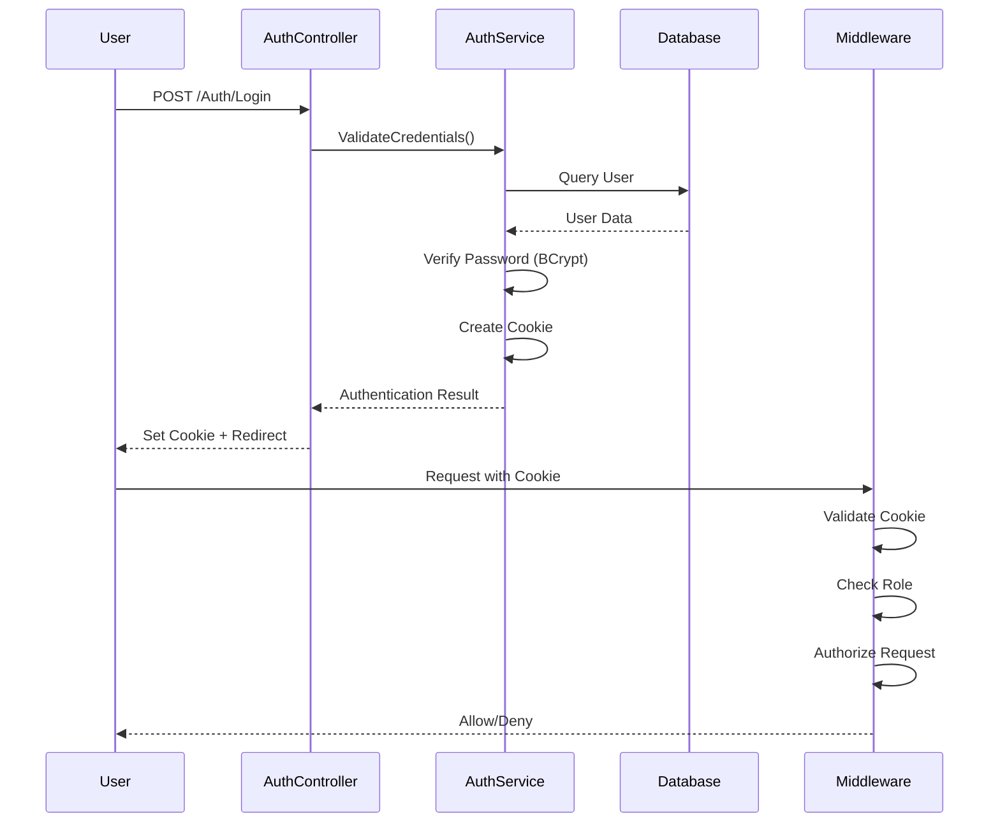
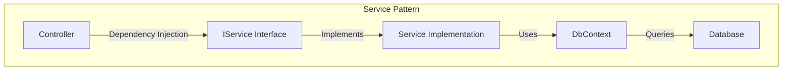

# 🏗️ Diagrama de Arquitectura - SchoolManager

**Fecha:** 2025-01-XX  
**Versión:** 1.0.0  
**Framework:** ASP.NET Core MVC 8.0

---

## 📋 Índice

1. [Arquitectura General en Capas](#1-arquitectura-general-en-capas)
2. [Arquitectura de Componentes](#2-arquitectura-de-componentes)
3. [Flujo de Datos](#3-flujo-de-datos)
4. [Arquitectura de Base de Datos](#4-arquitectura-de-base-de-datos)
5. [Arquitectura de Módulos](#5-arquitectura-de-módulos)
6. [Flujo de Autenticación y Autorización](#6-flujo-de-autenticación-y-autorización)
7. [Arquitectura de Servicios](#7-arquitectura-de-servicios)

---

## 1. Arquitectura General en Capas

### Diagrama de Capas



### Descripción de Capas

```
┌─────────────────────────────────────────────────────────────┐
│                    PRESENTATION LAYER                        │
│  ┌──────────────┐  ┌──────────────┐  ┌──────────────┐     │
│  │ Controllers  │  │    Views     │  │  ViewModels  │     │
│  │   (35)      │  │    (95)      │  │    (32)      │     │
│  └──────────────┘  └──────────────┘  └──────────────┘     │
│                                                              │
│  ┌──────────────────────────────────────────────────────┐   │
│  │              Middleware (Auth, DateTime)             │   │
│  └──────────────────────────────────────────────────────┘   │
└─────────────────────────────────────────────────────────────┘
                            ↓
┌─────────────────────────────────────────────────────────────┐
│                  BUSINESS LOGIC LAYER                       │
│  ┌──────────────┐  ┌──────────────┐  ┌──────────────┐     │
│  │  Services   │  │  Interfaces  │  │    DTOs      │     │
│  │   (88)      │  │    (88)      │  │    (46)      │     │
│  └──────────────┘  └──────────────┘  └──────────────┘     │
│                                                              │
│  ┌──────────────────────────────────────────────────────┐   │
│  │              AutoMapper (Mappings)                    │   │
│  └──────────────────────────────────────────────────────┘   │
└─────────────────────────────────────────────────────────────┘
                            ↓
┌─────────────────────────────────────────────────────────────┐
│                   DATA ACCESS LAYER                          │
│  ┌──────────────┐  ┌──────────────┐  ┌──────────────┐     │
│  │   DbContext  │  │    Models    │  │  Migrations  │     │
│  │  (EF Core)   │  │    (39)      │  │  (EF Core)   │     │
│  └──────────────┘  └──────────────┘  └──────────────┘     │
└─────────────────────────────────────────────────────────────┘
                            ↓
┌─────────────────────────────────────────────────────────────┐
│                  INFRASTRUCTURE LAYER                       │
│  ┌──────────────┐  ┌──────────────┐  ┌──────────────┐     │
│  │  PostgreSQL  │  │  Cloudinary  │  │ Email SMTP  │     │
│  │   Database    │  │ File Storage  │  │   Service   │     │
│  └──────────────┘  └──────────────┘  └──────────────┘     │
└─────────────────────────────────────────────────────────────┘
```

---

## 2. Arquitectura de Componentes

### Diagrama de Componentes Principales



### Estructura de Componentes

```
┌──────────────────────────────────────────────────────────────┐
│                      CLIENT (Browser)                        │
│  ┌────────────────────────────────────────────────────────┐ │
│  │  HTML/CSS/JavaScript (jQuery, Bootstrap)              │ │
│  └────────────────────────────────────────────────────────┘ │
└────────────────────────────┬─────────────────────────────────┘
                             │ HTTP Request/Response
                             ↓
┌──────────────────────────────────────────────────────────────┐
│              ASP.NET CORE MVC APPLICATION                   │
│                                                              │
│  ┌────────────────────────────────────────────────────────┐ │
│  │              MIDDLEWARE PIPELINE                        │ │
│  │  1. Exception Handler                                   │ │
│  │  2. Static Files                                        │ │
│  │  3. Routing                                             │ │
│  │  4. DateTime Middleware                                 │ │
│  │  5. Authentication (Cookie)                             │ │
│  │  6. Authorization (Role-based)                          │ │
│  │  7. Session Validation                                  │ │
│  └────────────────────────────────────────────────────────┘ │
│                                                              │
│  ┌────────────────────────────────────────────────────────┐ │
│  │                    CONTROLLERS                          │ │
│  │  ┌──────────┐  ┌──────────┐  ┌──────────┐            │ │
│  │  │   Auth   │  │ Student  │  │ Payment  │  ... 35     │ │
│  │  └──────────┘  └──────────┘  └──────────┘            │ │
│  └────────────────────────────────────────────────────────┘ │
│                                                              │
│  ┌────────────────────────────────────────────────────────┐ │
│  │                    SERVICES                            │ │
│  │  ┌──────────┐  ┌──────────┐  ┌──────────┐            │ │
│  │  │ Student │  │ Payment  │  │  Email   │  ... 88     │ │
│  │  │ Service │  │ Service  │  │ Service  │            │ │
│  │  └──────────┘  └──────────┘  └──────────┘            │ │
│  └────────────────────────────────────────────────────────┘ │
│                                                              │
│  ┌────────────────────────────────────────────────────────┐ │
│  │                  SCHOOL DB CONTEXT                      │ │
│  │              (Entity Framework Core)                   │ │
│  └────────────────────────────────────────────────────────┘ │
└────────────────────────────┬─────────────────────────────────┘
                             │
                             ↓
┌──────────────────────────────────────────────────────────────┐
│                    EXTERNAL SERVICES                          │
│  ┌──────────────┐  ┌──────────────┐  ┌──────────────┐      │
│  │  PostgreSQL  │  │  Cloudinary  │  │ SMTP Server  │      │
│  │   Database    │  │ File Storage  │  │   (Email)   │      │
│  └──────────────┘  └──────────────┘  └──────────────┘      │
└──────────────────────────────────────────────────────────────┘
```

---

## 3. Flujo de Datos

### Flujo de Request/Response



### Flujo de Datos Detallado

```
┌─────────┐
│ Client  │
└────┬────┘
     │ 1. HTTP Request
     ↓
┌─────────────────────────────────────┐
│   Middleware Pipeline               │
│   • Exception Handler               │
│   • Static Files                    │
│   • Routing                         │
│   • DateTime Middleware             │
│   • Authentication                  │
│   • Authorization                   │
└────┬────────────────────────────────┘
     │ 2. Authenticated Request
     ↓
┌─────────────────────────────────────┐
│   Controller                        │
│   • Receives Request                │
│   • Validates Input                 │
│   • Calls Service                   │
└────┬────────────────────────────────┘
     │ 3. Service Call
     ↓
┌─────────────────────────────────────┐
│   Service Layer                     │
│   • Business Logic                  │
│   • Data Validation                │
│   • Calls DbContext                 │
└────┬────────────────────────────────┘
     │ 4. Database Query
     ↓
┌─────────────────────────────────────┐
│   SchoolDbContext (EF Core)         │
│   • LINQ Queries                    │
│   • Change Tracking                 │
│   • SQL Generation                  │
└────┬────────────────────────────────┘
     │ 5. SQL Query
     ↓
┌─────────────────────────────────────┐
│   PostgreSQL Database               │
│   • Execute Query                   │
│   • Return Data                     │
└────┬────────────────────────────────┘
     │ 6. Data Result
     ↓
┌─────────────────────────────────────┐
│   Service Layer                     │
│   • Map to DTO                      │
│   • Apply Business Rules            │
└────┬────────────────────────────────┘
     │ 7. DTO/ViewModel
     ↓
┌─────────────────────────────────────┐
│   Controller                        │
│   • Map to ViewModel                │
│   • Select View                     │
└────┬────────────────────────────────┘
     │ 8. View/JSON
     ↓
┌─────────────────────────────────────┐
│   Razor View Engine                 │
│   • Render HTML                     │
│   • Include JavaScript/CSS          │
└────┬────────────────────────────────┘
     │ 9. HTTP Response
     ↓
┌─────────┐
│ Client  │
└─────────┘
```

---

## 4. Arquitectura de Base de Datos

### Diagrama ER Simplificado



### Estructura de Tablas Principales

```
┌──────────────────────────────────────────────────────────────┐
│                    CORE ENTITIES                             │
│                                                              │
│  ┌──────────────┐      ┌──────────────┐                    │
│  │   SCHOOLS    │      │    USERS     │                    │
│  │  (Multi-     │◄─────┤  (10 Roles)  │                    │
│  │  escuela)    │      │              │                    │
│  └──────────────┘      └──────┬───────┘                    │
│                               │                             │
│                               │                             │
│  ┌────────────────────────────▼──────────────────────────┐ │
│  │         STUDENT_ASSIGNMENTS                            │ │
│  │  (Asignación de estudiantes a grupos/grados)          │ │
│  │  • student_id → users.id                               │ │
│  │  • grade_id → grade_levels.id                          │ │
│  │  • group_id → groups.id                                │ │
│  │  • shift_id → shifts.id                                 │ │
│  │  • academic_year_id → academic_years.id                │ │
│  │  • is_active (solo asignaciones activas)               │ │
│  └────────────────────────────────────────────────────────┘ │
│                                                              │
│  ┌──────────────┐      ┌──────────────┐                    │
│  │ GRADE_LEVELS │      │    GROUPS    │                    │
│  │  (Grados)    │      │  (A, B, C)   │                    │
│  └──────────────┘      └──────────────┘                    │
│                                                              │
│  ┌──────────────┐      ┌──────────────┐                    │
│  │    SHIFTS    │      │ ACADEMIC_    │                    │
│  │ (Jornadas)   │      │   YEARS      │                    │
│  └──────────────┘      └──────────────┘                    │
└──────────────────────────────────────────────────────────────┘

┌──────────────────────────────────────────────────────────────┐
│              PREMATRICULATION & PAYMENT                      │
│                                                              │
│  ┌──────────────────┐      ┌──────────────────┐          │
│  │ PREMATRICULATIONS│      │     PAYMENTS      │          │
│  │  • student_id     │◄────┤  • prematriculation_id       │
│  │  • grade_id       │      │  • payment_concept_id        │
│  │  • group_id       │      │  • amount                     │
│  │  • status         │      │  • payment_status             │
│  │  • period_id      │      └──────────────────┘          │
│  └──────────────────┘                                       │
│                                                              │
│  ┌──────────────────┐      ┌──────────────────┐          │
│  │ PREMATRICULATION │      │  PAYMENT_        │          │
│  │    PERIODS       │      │  CONCEPTS        │          │
│  └──────────────────┘      └──────────────────┘          │
└──────────────────────────────────────────────────────────────┘

┌──────────────────────────────────────────────────────────────┐
│                  ACADEMIC MODULE                             │
│                                                              │
│  ┌──────────────┐      ┌──────────────┐                    │
│  │  ACTIVITIES  │      │ STUDENT_     │                    │
│  │              │      │ ACTIVITY_    │                    │
│  │  • subject_id│      │ SCORES       │                    │
│  │  • group_id  │      │  (Notas)     │                    │
│  │  • teacher_id│      │              │                    │
│  └──────────────┘      └──────────────┘                    │
│                                                              │
│  ┌──────────────┐      ┌──────────────┐                    │
│  │   SUBJECTS   │      │  TRIMESTERS   │                    │
│  │  (Materias)  │      │  (Trimestres) │                    │
│  └──────────────┘      └──────────────┘                    │
└──────────────────────────────────────────────────────────────┘
```

---

## 5. Arquitectura de Módulos

### Diagrama de Módulos Funcionales



### Estructura Modular

```
┌──────────────────────────────────────────────────────────────┐
│              MÓDULO 1: PREMATRÍCULA Y MATRÍCULA               │
│  ┌────────────────────────────────────────────────────────┐  │
│  │  PrematriculationController                           │  │
│  │    ↓                                                   │  │
│  │  PrematriculationService                              │  │
│  │  PrematriculationPeriodService                        │  │
│  │    ↓                                                   │  │
│  │  • Validación académica (max 3 materias reprobadas)   │  │
│  │  • Validación de período activo                       │  │
│  │  • Asignación automática de grupo                     │  │
│  │  • Generación de código único                         │  │
│  └────────────────────────────────────────────────────────┘  │
└──────────────────────────────────────────────────────────────┘
                            ↓
┌──────────────────────────────────────────────────────────────┐
│              MÓDULO 2: PAGOS                                  │
│  ┌────────────────────────────────────────────────────────┐  │
│  │  PaymentController                                     │  │
│  │    ↓                                                   │  │
│  │  PaymentService                                        │  │
│  │  PaymentConceptService                                 │  │
│  │    ↓                                                   │  │
│  │  • Registro de pagos (en línea y manual)              │  │
│  │  • Confirmación de pagos                               │  │
│  │  • Activación automática de matrícula                 │  │
│  └────────────────────────────────────────────────────────┘  │
└──────────────────────────────────────────────────────────────┘
                            ↓
┌──────────────────────────────────────────────────────────────┐
│              MÓDULO 3: GESTIÓN ACADÉMICA                     │
│  ┌────────────────────────────────────────────────────────┐  │
│  │  ActivityController, SubjectController, etc.           │  │
│  │    ↓                                                   │  │
│  │  ActivityService, SubjectService, etc.                 │  │
│  │    ↓                                                   │  │
│  │  • Gestión de actividades académicas                 │  │
│  │  • Calificaciones por actividad                       │  │
│  │  • Asignación de materias a grupos                    │  │
│  │  • Gestión de trimestres y años académicos            │  │
│  └────────────────────────────────────────────────────────┘  │
└──────────────────────────────────────────────────────────────┘

┌──────────────────────────────────────────────────────────────┐
│              MÓDULO 4: ASISTENCIA                            │
│  ┌────────────────────────────────────────────────────────┐  │
│  │  AttendanceController                                  │  │
│  │    ↓                                                   │  │
│  │  AttendanceService                                    │  │
│  │    ↓                                                   │  │
│  │  • Registro de asistencia diaria                       │  │
│  │  • Reportes estadísticos                               │  │
│  └────────────────────────────────────────────────────────┘  │
└──────────────────────────────────────────────────────────────┘

┌──────────────────────────────────────────────────────────────┐
│              MÓDULO 5: REPORTES                               │
│  ┌────────────────────────────────────────────────────────┐  │
│  │  DisciplineReportController, OrientationReportController│ │
│  │    ↓                                                   │  │
│  │  DisciplineReportService, OrientationReportService    │  │
│  │  StudentReportService, AprobadosReprobadosService     │  │
│  │    ↓                                                   │  │
│  │  • Reportes disciplinarios                             │  │
│  │  • Reportes de orientación                             │  │
│  │  • Reportes académicos                                 │  │
│  └────────────────────────────────────────────────────────┘  │
└──────────────────────────────────────────────────────────────┘

┌──────────────────────────────────────────────────────────────┐
│              MÓDULO 6: ADMINISTRACIÓN                         │
│  ┌────────────────────────────────────────────────────────┐  │
│  │  UserController, SchoolController, SuperAdminController│ │
│  │    ↓                                                   │  │
│  │  UserService, SchoolService, SuperAdminService         │  │
│  │  AuditLogService, EmailService, SecuritySettingService  │  │
│  │    ↓                                                   │  │
│  │  • Gestión de usuarios y roles                        │  │
│  │  • Gestión de escuelas (multi-escuela)                │  │
│  │  • Auditoría completa                                  │  │
│  │  • Configuración de seguridad                          │  │
│  └────────────────────────────────────────────────────────┘  │
└──────────────────────────────────────────────────────────────┘
```

---

## 6. Flujo de Autenticación y Autorización

### Diagrama de Autenticación



### Flujo de Autorización

```
┌─────────┐
│  User   │
└────┬────┘
     │ 1. POST /Auth/Login
     │    { email, password }
     ↓
┌─────────────────────────────────────┐
│   AuthController                     │
│   • Receives credentials             │
│   • Calls AuthService                │
└────┬─────────────────────────────────┘
     │ 2. ValidateCredentials()
     ↓
┌─────────────────────────────────────┐
│   AuthService                        │
│   • Query user by email              │
│   • Verify password (BCrypt)         │
│   • Check status = 'active'          │
│   • Create authentication cookie     │
└────┬─────────────────────────────────┘
     │ 3. Cookie Created
     ↓
┌─────────────────────────────────────┐
│   Response with Cookie               │
│   • Set-Cookie: Authentication      │
│   • Redirect to Home                 │
└────┬─────────────────────────────────┘
     │ 4. Subsequent Requests
     ↓
┌─────────────────────────────────────┐
│   Authentication Middleware         │
│   • Read cookie                      │
│   • Validate session                 │
│   • Extract user info                │
└────┬─────────────────────────────────┘
     │ 5. User Authenticated
     ↓
┌─────────────────────────────────────┐
│   Authorization Middleware           │
│   • Check [Authorize(Roles="...")]  │
│   • Verify user role                 │
│   • Allow/Deny access                │
└────┬─────────────────────────────────┘
     │ 6. Authorized Request
     ↓
┌─────────────────────────────────────┐
│   Controller Action                 │
│   • Execute business logic           │
└─────────────────────────────────────┘
```

### Roles y Permisos

```
┌──────────────────────────────────────────────────────────────┐
│                    ROLES DISPONIBLES                         │
│                                                              │
│  ┌──────────────┐  ┌──────────────┐  ┌──────────────┐     │
│  │ SuperAdmin   │  │    Admin     │  │   Director   │     │
│  │ (Máximo)     │  │ (General)    │  │ (Dirección)  │     │
│  └──────────────┘  └──────────────┘  └──────────────┘     │
│                                                              │
│  ┌──────────────┐  ┌──────────────┐  ┌──────────────┐     │
│  │   Teacher    │  │   Student    │  │   Parent    │     │
│  │  (Docente)   │  │ (Estudiante)  │  │ (Acudiente)  │     │
│  └──────────────┘  └──────────────┘  └──────────────┘     │
│                                                              │
│  ┌──────────────┐                                           │
│  │ Contabilidad │                                           │
│  │ (Accounting) │                                           │
│  └──────────────┘                                           │
└──────────────────────────────────────────────────────────────┘

┌──────────────────────────────────────────────────────────────┐
│              POLÍTICAS DE AUTORIZACIÓN                        │
│                                                              │
│  [Authorize(Roles = "SuperAdmin")]                          │
│  [Authorize(Roles = "Admin")]                               │
│  [Authorize(Roles = "Teacher")]                             │
│  [Authorize(Roles = "Student,Estudiante")]                  │
│  [Authorize(Roles = "Parent,Acudiente")]                    │
│  [Authorize(Roles = "Contabilidad,Admin,SuperAdmin")]       │
└──────────────────────────────────────────────────────────────┘
```

---

## 7. Arquitectura de Servicios

### Patrón de Servicios



### Estructura de Servicios

```
┌──────────────────────────────────────────────────────────────┐
│              PATRÓN DE SERVICIOS                             │
│                                                              │
│  Controller                                                  │
│    ↓ (Dependency Injection)                                 │
│  ┌────────────────────────────────────────────────────────┐ │
│  │  IService Interface                                     │ │
│  │  • Define contract                                      │ │
│  │  • Method signatures                                    │ │
│  └────────────────────────────────────────────────────────┘ │
│    ↓ (Implements)                                           │
│  ┌────────────────────────────────────────────────────────┐ │
│  │  Service Implementation                                │ │
│  │  • Business logic                                       │ │
│  │  • Data validation                                      │ │
│  │  • Calls DbContext                                      │ │
│  └────────────────────────────────────────────────────────┘ │
│    ↓ (Uses)                                                 │
│  ┌────────────────────────────────────────────────────────┐ │
│  │  SchoolDbContext (EF Core)                             │ │
│  │  • LINQ queries                                         │ │
│  │  • Change tracking                                      │ │
│  │  • SQL generation                                       │ │
│  └────────────────────────────────────────────────────────┘ │
│    ↓ (Queries)                                              │
│  ┌────────────────────────────────────────────────────────┐ │
│  │  PostgreSQL Database                                    │ │
│  └────────────────────────────────────────────────────────┘ │
└──────────────────────────────────────────────────────────────┘

┌──────────────────────────────────────────────────────────────┐
│              REGISTRO DE SERVICIOS (Program.cs)               │
│                                                              │
│  builder.Services.AddScoped<IService, Service>();           │
│                                                              │
│  • Scoped: Una instancia por request HTTP                    │
│  • Permite inyección de dependencias                        │
│  • Facilita testing con mocks                               │
│  • Bajo acoplamiento entre componentes                     │
└──────────────────────────────────────────────────────────────┘
```

### Ejemplo de Servicio

```
┌──────────────────────────────────────────────────────────────┐
│  IStudentService (Interface)                                │
│  ┌────────────────────────────────────────────────────────┐ │
│  │  Task<StudentDto> GetByIdAsync(Guid id);              │ │
│  │  Task<List<StudentDto>> GetAllAsync();                 │ │
│  │  Task<StudentDto> CreateAsync(CreateStudentDto dto);   │ │
│  │  Task<StudentDto> UpdateAsync(UpdateStudentDto dto);   │ │
│  │  Task DeleteAsync(Guid id);                            │ │
│  └────────────────────────────────────────────────────────┘ │
└──────────────────────────────────────────────────────────────┘
                            ↓
┌──────────────────────────────────────────────────────────────┐
│  StudentService (Implementation)                             │
│  ┌────────────────────────────────────────────────────────┐ │
│  │  private readonly SchoolDbContext _context;            │ │
│  │                                                         │ │
│  │  public async Task<StudentDto> GetByIdAsync(Guid id)   │ │
│  │  {                                                     │ │
│  │      var student = await _context.Users                │ │
│  │          .Include(s => s.StudentAssignments)          │ │
│  │          .FirstOrDefaultAsync(s => s.Id == id);       │ │
│  │                                                         │ │
│  │      return _mapper.Map<StudentDto>(student);         │ │
│  │  }                                                     │ │
│  └────────────────────────────────────────────────────────┘ │
└──────────────────────────────────────────────────────────────┘
```

---

## 📊 Resumen de Arquitectura

### Características Principales

1. **Arquitectura en Capas**: Separación clara de responsabilidades
2. **Inyección de Dependencias**: Todos los servicios registrados como Scoped
3. **Patrón Repository**: Implícito a través de EF Core
4. **DTO Pattern**: Transferencia de datos mediante DTOs
5. **AutoMapper**: Mapeo automático entre entidades y DTOs
6. **Multi-escuela**: Soporte para múltiples instituciones
7. **Multi-rol**: 10 roles con permisos granulares
8. **Auditoría**: Registro completo de acciones

### Tecnologías Utilizadas

- **Backend**: ASP.NET Core MVC 8.0
- **ORM**: Entity Framework Core 9.0.3
- **Base de Datos**: PostgreSQL
- **Autenticación**: Cookie Authentication
- **Autorización**: Role-based Authorization
- **Mapeo**: AutoMapper 12.0.1
- **Almacenamiento**: Cloudinary + LocalFileStorage
- **Email**: SMTP configurable

### Estadísticas

- **Controladores**: 35
- **Servicios**: 88 (88 interfaces + 88 implementaciones)
- **Modelos**: 39 entidades
- **Vistas**: 95 Razor Views
- **DTOs**: 46 objetos de transferencia
- **ViewModels**: 32
- **Roles**: 10 diferentes

---

**Última actualización:** 2025-01-XX  
**Versión del documento:** 1.0  
**Estado:** ✅ Arquitectura documentada
